# 🏔️ Roadbook - Team Coudoux - Tour du Mont Blanc

  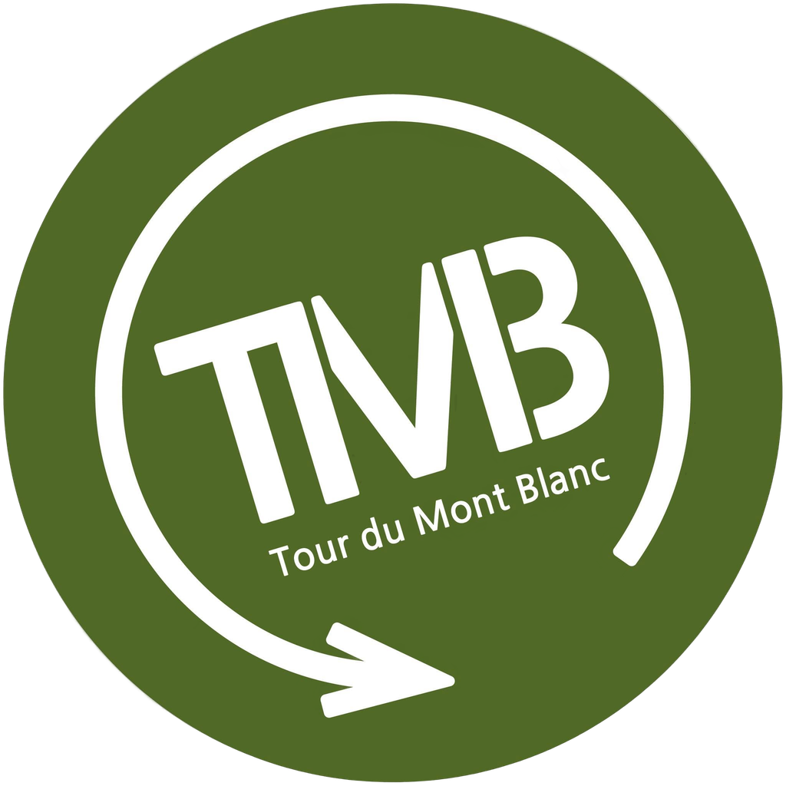

*Un défi alpine intense : **151 km**, **9 100 m D+**, traversant **France, Italie et Suisse** en 5 jours.*

> ✅ **C'est fait — 14-18 juin 2026.** Réalisé à **4** (Mehdi, Nicolas, Franck, Matthieu) : **168 km / 9 419 m D+**. 👉 [**Voir le bilan & les photos**](#bilan-du-tmb-juin-2026)

---

📍 **Trace GPS prévue** : [VisuGPX](https://www.visugpx.com/YYtOE8PUpF) · ✅ **Trace GPS réelle** : [VisuGPX](https://www.visugpx.com/JHP6AVSEyy) · [📥 GPX total](./assets/gpx/Tour_du_Mont_Blanc_2026.gpx)

---

## 📊 Informations Clés

| **Paramètre** | **Valeur** | **Remarques** |
|---|---|---|
| **Distance** | 151 km | Variante du TMB classique |
| **Dénivelé +** | 9 100 m | Équivalent à 3x l'ascension du Mont Ventoux |
| **Durée** | 5 jours | Rythme soutenu (8-9h de marche/jour) |
| **Niveau** | 🔴 **Difficile** | Grosses cuisses requises |
| **Hébergement** | Refuges | Pour pas trop gélérer |

---

## 📅 **Planning Général**

| **Date** | **Programme** | **Hébergement** |
|----------|---------------|-----------------|
| **Sam 13/06/2026** | Coudoux → Chamonix (arrivée, installation) | Chamonix |
| **Dim 14/06/2026** | **J1 TMB** : Chamonix → Refuge des Prés | Refuge des Prés |
| **Lun 15/06/2026** | **J2 TMB** : Refuge des Prés → Courmayeur | Courmayeur |
| **Mar 16/06/2026** | **J3 TMB** : Courmayeur → La Fouly | Gîte de la Fouly |
| **Mer 17/06/2026** | **J4 TMB** : La Fouly → Trient | Auberge Mont-Blanc |
| **Jeu 18/06/2026** | **J5 TMB** : Trient → Chamonix | Chamonix |
| **Ven 19/06/2026** | Chamonix → Coudoux (retour) | - |

---

## 🗺️ **Itinéraire Jour par Jour**

### **Samedi 13/06/2026 : Coudoux → Chamonix**
- **Trajet** : Coudoux → Chamonix (~6h de route)
- **Programme** : Installation, préparatifs, repas du soir
- **Hébergement** : Chamonix (hôtel/gîte/AirBnB)

### **Dimanche 14/06/2026 - J1 TMB : Chamonix → Refuge des Prés**
- **Distance** : 33 km | **D+** : 2 500 m | **Durée** : ~9h
- **Points clés** :
    - Départ symbolique sous l'arche des **Houches**.
    - Montée raide vers le **Col de Voza** (1 653 m).
    - Arrivée au **Refuge des Prés** (2 500 m).
- **Trace GPS** : [Lien VisuGPX](https://www.visugpx.com/YYtOE8PUpF?e=1)

### **Lundi 15/06/2026 - J2 TMB : Refuge des Prés → Courmayeur (Italie)**
- **Distance** : 35 km | **D+** : 1 700 m | **Durée** : ~8h
- **Points clés** :
    - Passage du **Col des Fours** (2 665 m) avec vue sur le **Glacier de Miage**.
    - Descente vers le **Val Vény** et arrivée à **Courmayeur**.
    - **Réapprovisionnement** possible (supermarché Carrefour Market).
- **Trace GPS** : [Lien VisuGPX](https://www.visugpx.com/YYtOE8PUpF?e=2)

### **Mardi 16/06/2026 - J3 TMB : Courmayeur → La Fouly (Suisse)**
- **Distance** : 31 km | **D+** : 2 000 m | **Durée** : ~8h
- **Points clés** :
    - Traversée du **Val Ferret italien** (paysages lunaires).
    - Montée vers le **Grand Col Ferret** (2 537 m, frontière CH).
    - Descente vers le village suisse de **La Fouly**.
- **Trace GPS** : [Lien VisuGPX](https://www.visugpx.com/YYtOE8PUpF?e=3)

### **Mercredi 17/06/2026 - J4 TMB : La Fouly → Col de Balme (Étape Reine ⭐)**
- **Distance** : 31 km | **D+** : 2 600 m | **Durée** : ~9h
- **Points clés** :
    - Passage technique de la **Fenêtre d'Arpette** (2 665 m, **F+**, mains nécessaires).
    - **Alternative** : Col de la Forclaz (moins technique mais plus long).
    - Arrivée au **Col de Balme** (2 191 m) avec vue sur Chamonix.
- **Trace GPS** : [Lien VisuGPX](https://www.visugpx.com/YYtOE8PUpF?e=4)

### **Jeudi 18/06/2026 - J5 TMB : Col de Balme → Chamonix (Retour)**
- **Distance** : 21 km | **D+** : 300 m | **Durée** : ~6h
- **Points clés** :
    - Descente vers **Argentière** via le **Lac Blanc**.
    - Retour à Chamonix par la **vallée de l'Arve**.
    - **Célébration finale** sous l'arche des Houches !
- **Hébergement** : Chamonix (hôtel/gîte/AirBnB)
- **Trace GPS** : [Lien VisuGPX](https://www.visugpx.com/YYtOE8PUpF?e=5)

### **Vendredi 19/06/2026 : Chamonix → Coudoux**
- **Programme** : Petit-déjeuner, récupération matériel, retour
- **Trajet** : Chamonix → Coudoux (~6h de route)

---

## Bilan du TMB (juin 2026)

  

> **Team Coudoux : Mehdi, Nicolas, Franck & Matthieu.** Partis pour être 6, mais 2 forfaits sur blessure (Stéphane & Michael) avant le départ → bouclé à **4**. 5 étapes, 3 pays, du **14 au 18 juin 2026**.

### 📊 Le TMB réel (données Strava GPS)

| **Paramètre** | **Prévu (roadbook)** | **Réel** |
|---|---|---|
| **Distance** | 151 km | **168 km** |
| **Dénivelé +** | 9 100 m | **9 419 m** |
| **Temps en mouvement** | ~40 h | **45 h 07** |
| **Étapes** | 5 | 5 |
| **Énergie** | — | **~18 340 kcal** |

> L'écart de distance (+17 km) vient des lacets et épingles comptés par le GPS mais pas par le topo. Écart classique.

🗺️ **Trace complète réelle** : [VisuGPX](https://www.visugpx.com/JHP6AVSEyy) · [📥 GPX total](./assets/gpx/Tour_du_Mont_Blanc_2026.gpx)

  <a href="./assets/images/carte_tour.png" target="_blank" rel="noopener">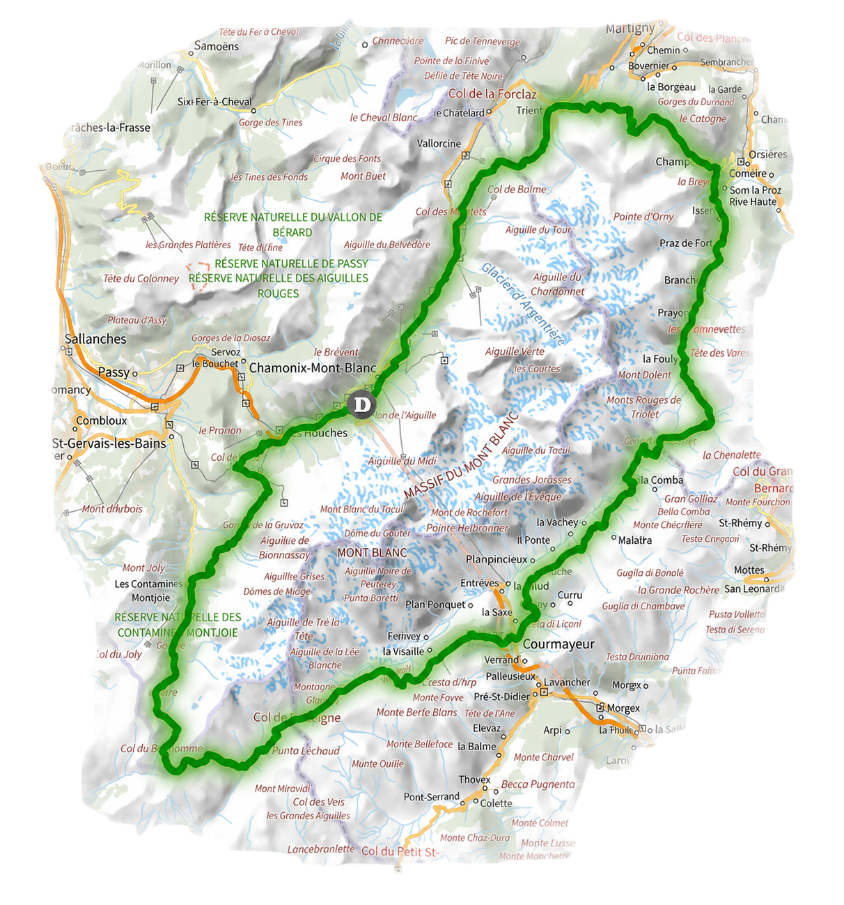</a>

  <a href="./assets/images/profil.png" target="_blank" rel="noopener">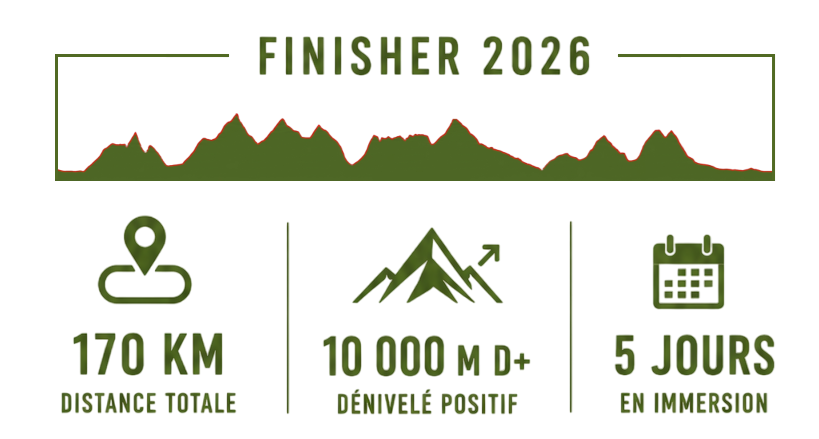</a>

### 🗓️ Étape par étape (réel)

| Étape | Parcours | Distance | D+ | D- | Mouvement | Total | GPX |
|---|---|---|---|---|---|---|---|
| **J1** — Dim 14/06 | Les Houches 🇫🇷 → Refuge des Prés 🇫🇷 | 28,4 km | 2 332 m | 1 435 m | 8h30 | 9h44 | [📥](./assets/gpx/Tour_du_Mont_Blanc_J1.gpx) |
| **J2** — Lun 15/06 | Refuge des Prés 🇫🇷 → Courmayeur 🇮🇹 | 38,3 km | 2 242 m | 2 967 m | 10h49 | 12h41 | [📥](./assets/gpx/Tour_du_Mont_Blanc_J2.gpx) |
| **J3** — Mar 16/06 | Courmayeur 🇮🇹 → La Fouly 🇨🇭 | 33,5 km | 2 161 m | 1 775 m | 8h36 | 10h02 | [📥](./assets/gpx/Tour_du_Mont_Blanc_J3.gpx) |
| **J4** — Mer 17/06 | La Fouly 🇨🇭 → Trient 🇨🇭 | 32,6 km | 1 421 m | 1 743 m | 8h22 | 9h47 | [📥](./assets/gpx/Tour_du_Mont_Blanc_J4.gpx) |
| **J5** — Jeu 18/06 | Trient 🇨🇭 → Les Houches 🇫🇷 🏁 | 35,2 km | 1 263 m | 1 542 m | 8h49 | 10h20 | [📥](./assets/gpx/Tour_du_Mont_Blanc_J5_Finish.gpx) |
| **Total** | Les Houches 🇫🇷 → Les Houches 🇫🇷 | **168 km** | **9 419 m** | **9 462 m** | **45h07** | — | [📥](./assets/gpx/Tour_du_Mont_Blanc_2026.gpx) |

---

#### 🥾 J1 — Les Houches → Refuge des Prés

> *« Dur mais tellement magnifique ☺️😍 ⛰️🏔️🏞️ »*

  <a href="./assets/images/photos/IMG20260614111054-resize.jpg" target="_blank" rel="noopener">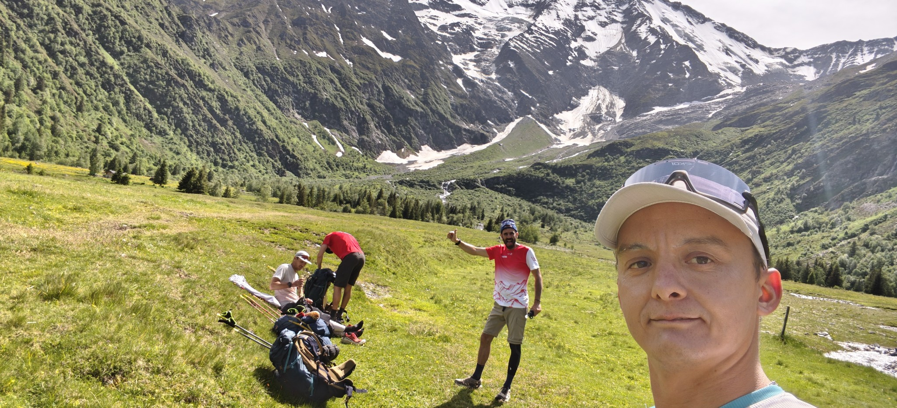</a>

  <a href="./assets/images/photos/IMG20260614170806-resize.jpg" target="_blank" rel="noopener">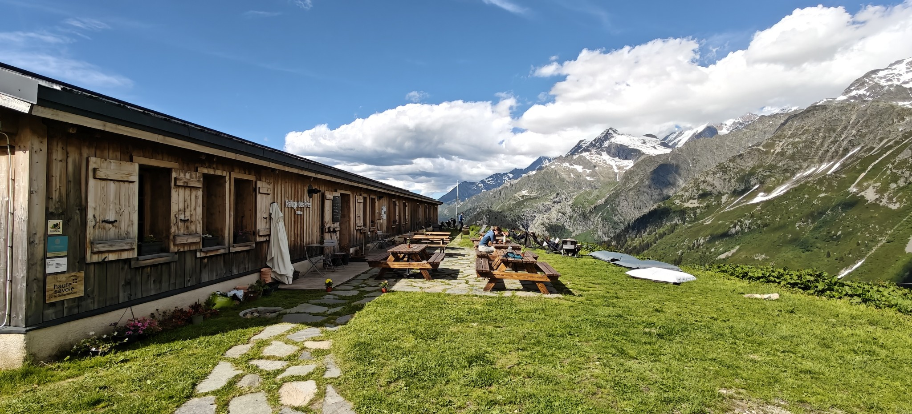</a>

#### 🥾 J2 — Refuge des Prés → Courmayeur 🇮🇹 *(l'étape la plus dure)*

> *« Toujours aussi magnifique 😍 Mais qu'elle était dure cette étape 😱🥵 Presque 40 km avec 3 000 m de D- 🤯 »*

Grosse journée : ~40 km, quasi 3 000 m de descente, passage en Italie.

  <a href="./assets/images/photos/IMG20260615083647.jpg" target="_blank" rel="noopener">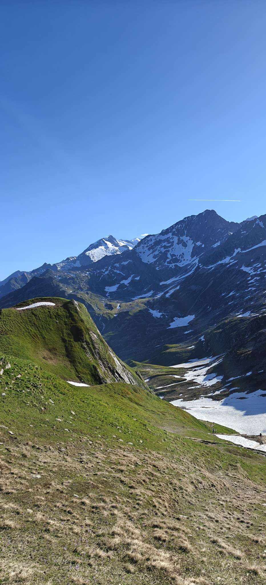</a>

  <a href="./assets/images/photos/IMG20260615104800.jpg" target="_blank" rel="noopener">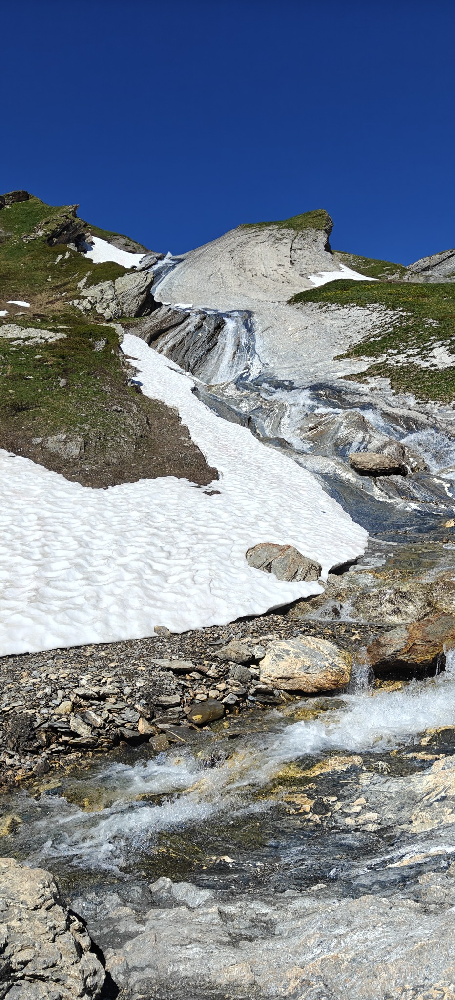</a>

  <a href="./assets/images/photos/IMG20260615122850.jpg" target="_blank" rel="noopener">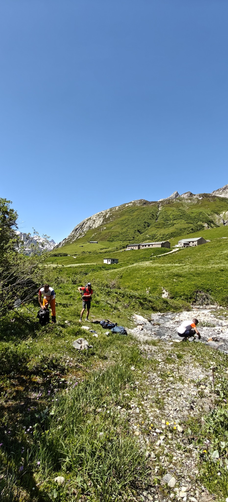</a>

  <a href="./assets/images/photos/IMG20260615141505.jpg" target="_blank" rel="noopener">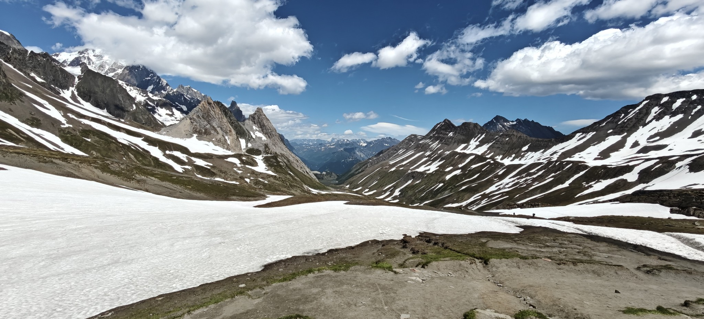</a>

#### 🥾 J3 — Courmayeur → La Fouly 🇨🇭

> *« Toujours aussi dur mais cette troisième journée s'est plutôt bien passée au vu de l'enchaînement 😬🥵 »*

  <a href="./assets/images/photos/IMG20260616085501-resize.jpg" target="_blank" rel="noopener">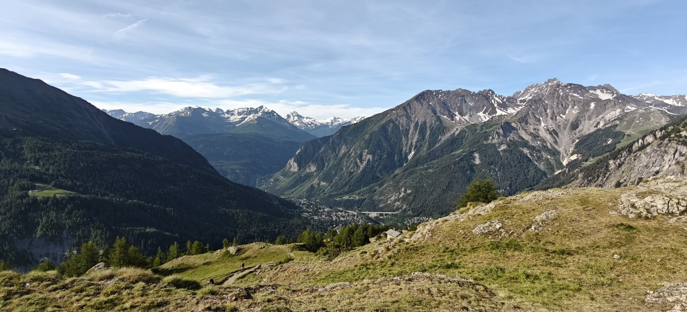</a>

  <a href="./assets/images/photos/IMG20260616093421-resize.jpg" target="_blank" rel="noopener">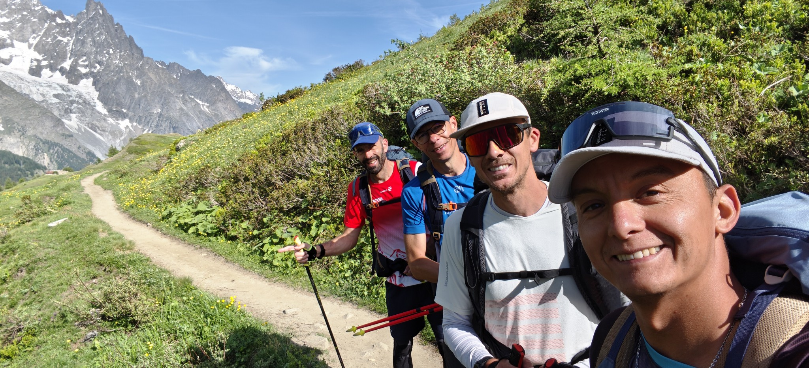</a>

  <a href="./assets/images/photos/IMG20260616134257-resize.jpg" target="_blank" rel="noopener">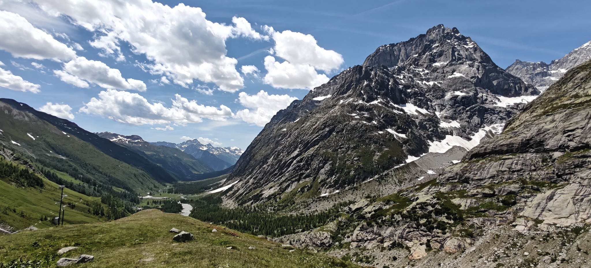</a>

  <a href="./assets/images/photos/IMG20260616143922-resize.jpg" target="_blank" rel="noopener">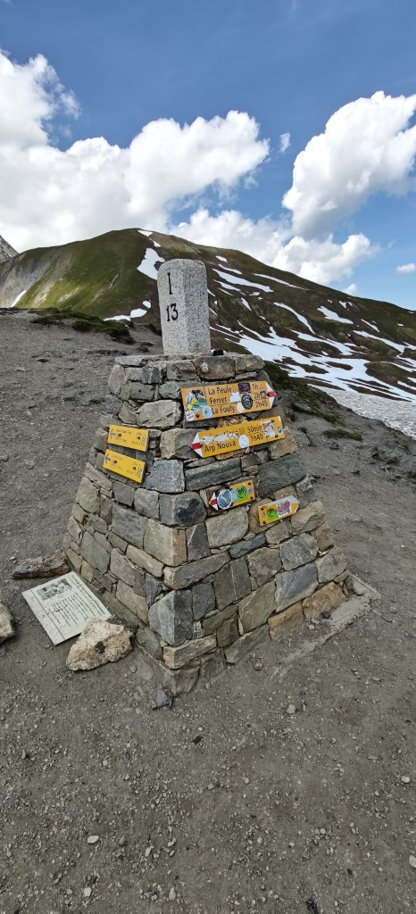</a>

#### 🥾 J4 — La Fouly → Trient 🇨🇭

Variante par le **Col de la Forclaz** (au lieu de la Fenêtre d'Arpette prévue) : moins technique, journée la plus roulante du parcours.

  <a href="./assets/images/photos/IMG20260617083300-resize.jpg" target="_blank" rel="noopener">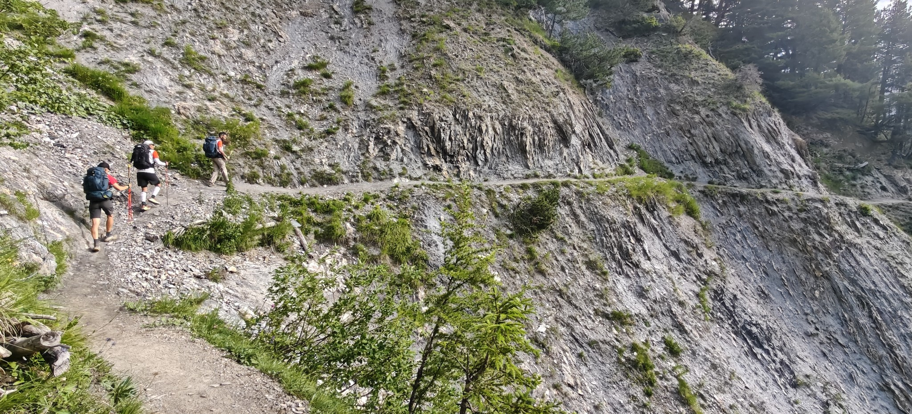</a>

  <a href="./assets/images/photos/IMG20260617111051-resize.jpg" target="_blank" rel="noopener">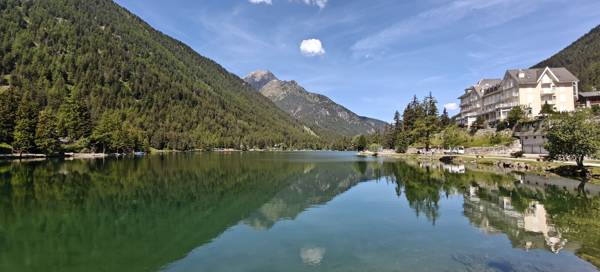</a>

  <a href="./assets/images/photos/IMG20260617144240-resize.jpg" target="_blank" rel="noopener">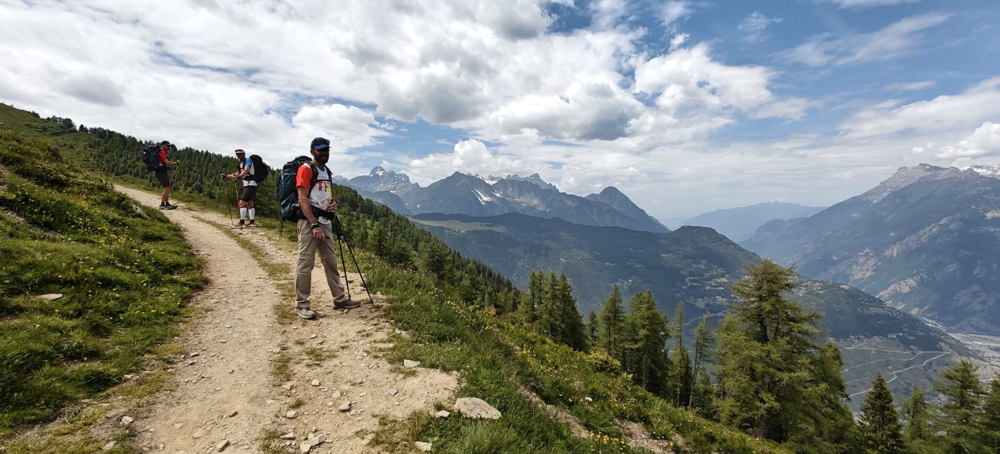</a>

  <a href="./assets/images/photos/IMG20260617161131-resize.jpg" target="_blank" rel="noopener">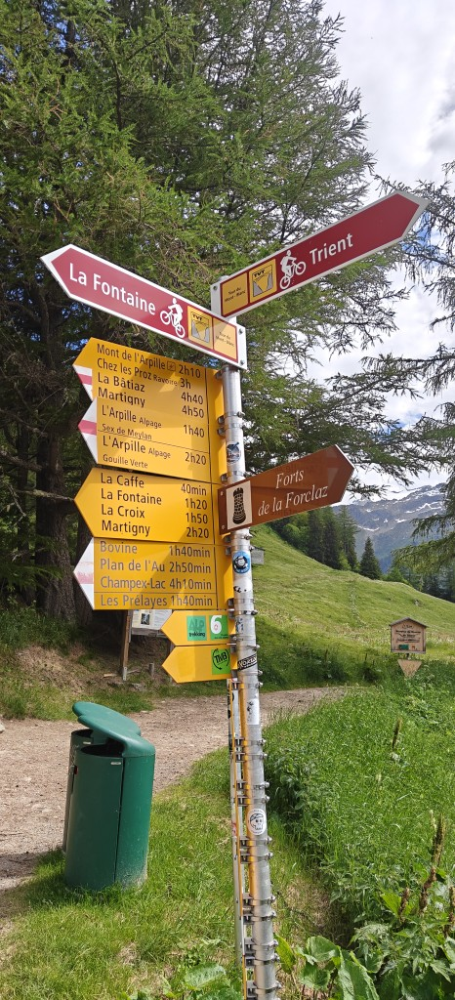</a>

#### 🥾 J5 — Trient → Les Houches 🏁 *(finish !)*

> *« Merci Franck, Nicolas, Matthieu — c'était un moment mémorable 😬🥵😍😊 »*

  <a href="./assets/images/photos/IMG20260618091437-resize.jpg" target="_blank" rel="noopener">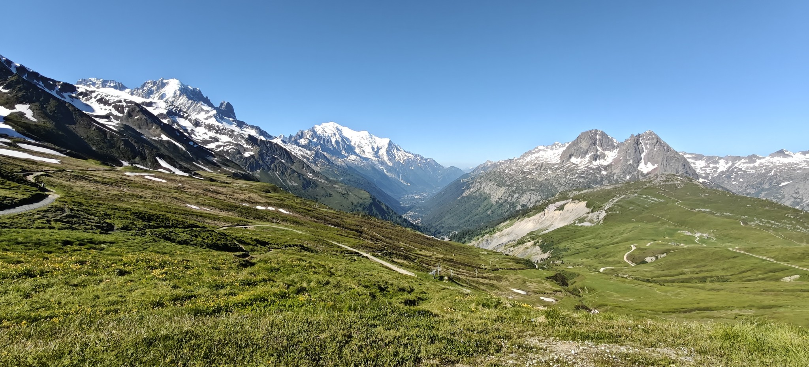</a>

  <a href="./assets/images/photos/IMG20260618091539-resize.jpg" target="_blank" rel="noopener">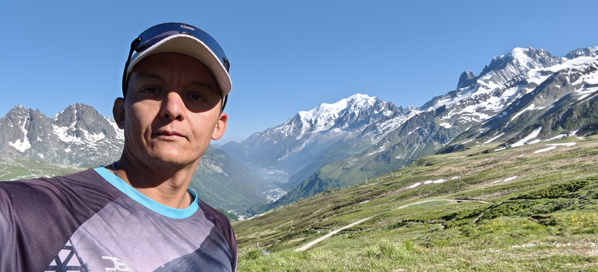</a>

  <a href="./assets/images/photos/photo-groupe-mb.jpg" target="_blank" rel="noopener">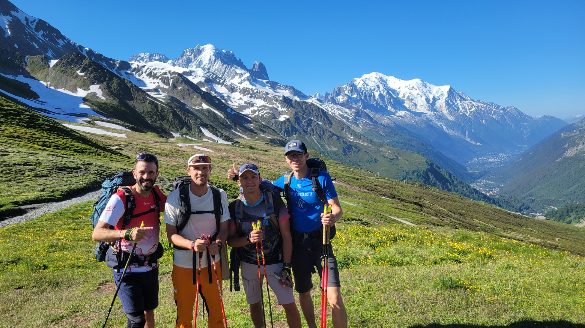</a>

  <a href="./assets/images/photos/IMG20260618110819-resize.jpg" target="_blank" rel="noopener">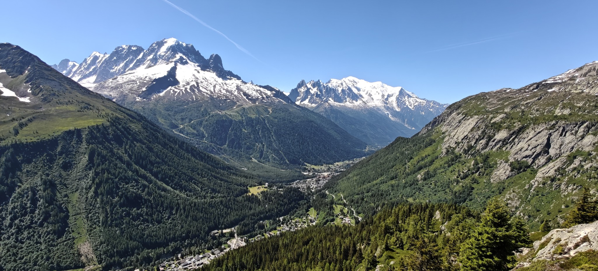</a>

  <a href="./assets/images/photos/IMG20260618165056.jpg" target="_blank" rel="noopener">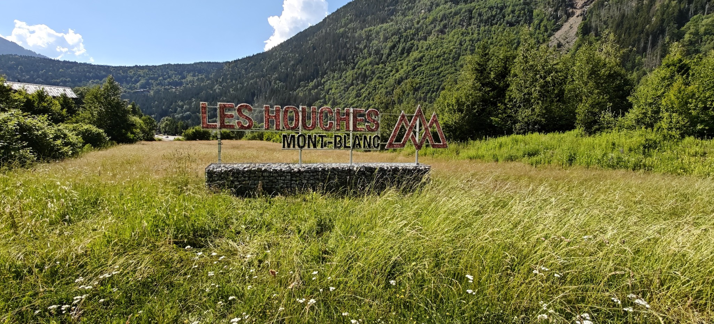</a>

*🏁 Arrivée aux Houches — c'est bouclé !*

  <a href="./assets/images/photos/photo_groupe_arrivee.jpg" target="_blank" rel="noopener">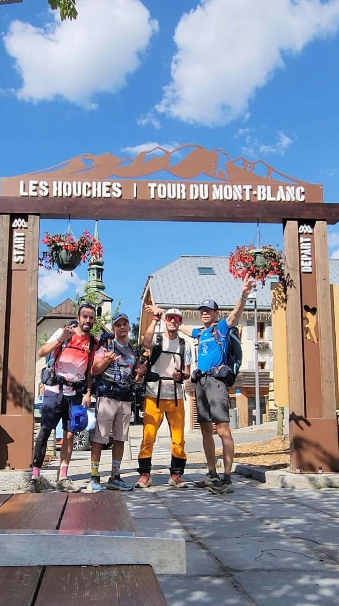</a>

---

## 🎒 Équipement & Hébergements

| 📋 [**Checklist Équipement**](./checklist.md) | 🏠 [**Liste des Hébergements**](./hebergements.md) |
|----------------------------------------------|---------------------------------------------------|
| Matériel indispensable pour 5 jours          | Refuges et réservations                           |

---
 
## 🛏️ Hébergements réservés

Nous avons été dans les hébergements suivants pour l'équipe (4 personnes) :

- **J0 — Samedi   13/06/2026** : [Chamonix Lodge](https://fr.chamonixlodge.com/) 
- **J1 — Dimanche 14/06/2026** : [Refuge des Prés](https://www.lerefugedespres.com/fr/)
- **J2 — Lundi    15/06/2026** : [Hotel Croux Courmayeur](https://www.hotelcroux.it/homepage.asp?l=2)
- **J3 — Mardi    16/06/2026** : [Gîte de la Fouly](https://gitedelafouly.ch/)
- **J4 — Mercredi 17/06/2026** : [Auberge Mont-Blanc Trient](https://www.aubergemontblanc.com/)
- **J5 — Jeudi    18/06/2026** : [Chamonix Lodge](https://fr.chamonixlodge.com/)

  <a href="./assets/images/carte_tour_nuits.png" target="_blank" rel="noopener">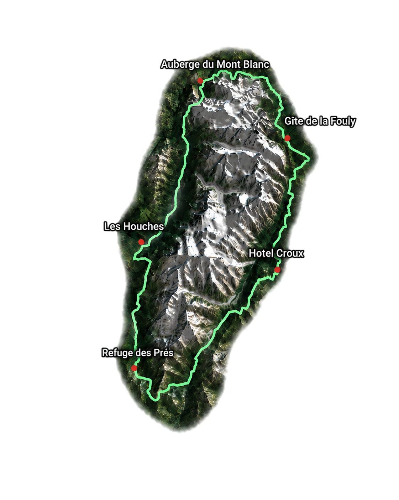</a>

> Remarque : détails et contacts des hébergements sont disponibles dans | 🏠 [**Liste des Hébergements**](./hebergements.md) |

---

## 🌦️ Météo & Sécurité

### 📡 Prévisions Météo
- 🇫🇷 [Météo France Montagne](https://meteofrance.com/montagne)
- 🇨🇭 [MétéoSuisse](https://www.meteosuisse.admin.ch/)

### ⚠️ Points d'Attention
- **Jour 4 (Fenêtre d'Arpette)** : Brouillard, givre, passage rocheux exposé
- **Alternatives** : Contour par le **Col de la Forclaz** (+2h, moins technique)

> 💡 **Conseil Pro** : Télécharger les cartes **hors ligne** (Fatmap, Komoot) et emporter une **batterie externe**.

---

## 💰 Budget réel

*Dépenses de groupe réelles (Splitwise), pour l'équipe de 4.*

| 💼 **Poste** | 💶 **Coût groupe** | 📝 **Détails** |
|---|---|---|
| 🏠 Hébergement | 2 461 € | Arrhes + nuitées refuges/hôtels + Chamonix Lodge (net d'un remboursement de 100 €) |
| 🍽️ Nourriture & restos | 310 € | Repas, bar, resto du retour |
| 🚗 Transport | 176 € | Péages + essence |
| 🛡️ Assurance | 133 € | Chapka (rapatriement) |
| 🎉 Extras | 411 € | Spa St-Gervais + t-shirts équipe |
| **🎯 TOTAL** | **~3 491 €** | soit **~873 € / personne** |

---

## 📚 Ressources Utiles

- 🎬 **Inspiration** : [*"Up for Light"* sur YouTube](https://youtu.be/eA5ITydpAg4)
- 🎬 **Inspiration** : [*Blog Simond*](https://www.simond.fr/le-tour-du-mont-blanc-en-5-jours)
- 🗺️ **Traces GPS** : [VisuGPX (complet)](https://www.visugpx.com/YYtOE8PUpF)
- 🗺️ **Cartes IGN** : [Topo TMB](https://ignrando.fr/fr/parcours/1128056-t-m-b)
- 💬 **Forum** : [Routard](https://www.routard.com/forums/t/tour-du-mont-blanc-mini-liste-de-conseil-matos-et-bon-plans/281691)

---

## ⚠️ Avertissements Importants

- ✅ **Niveau requis** : Expérience confirmée en Trail/Randonnée longue
- ❤️ **Santé** : Vérifier impérativement sa condition physique
- 🏥 **Assurance** : Souscrire une assurance rapatriement ([Chapka](https://www.chapka.fr/))
- 📞 **Urgences** : 112 (numéro d'urgence européen)
